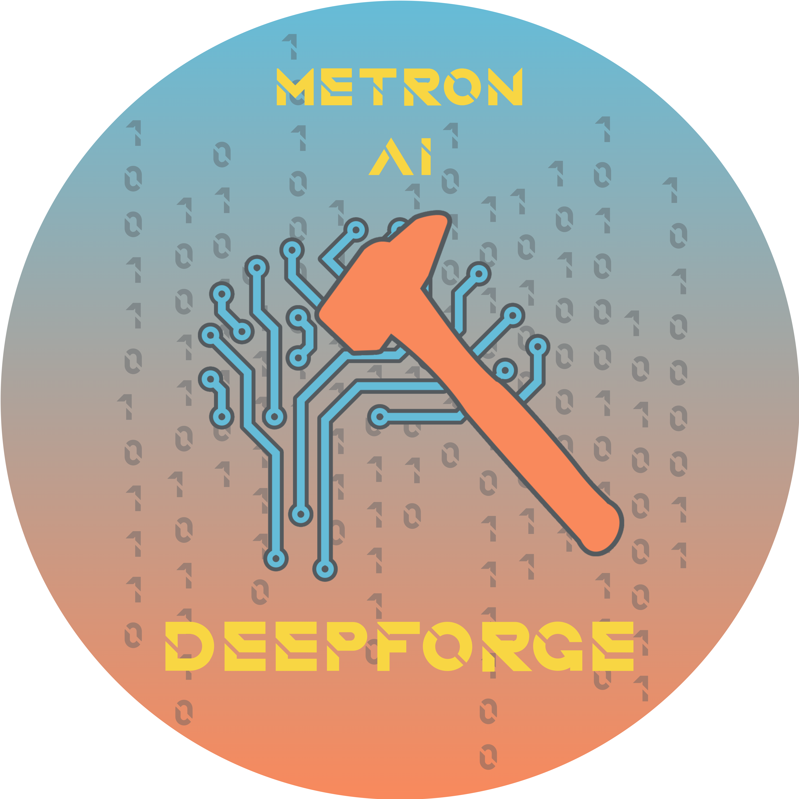

<h1 align="center">Metron AI - DeepForge</h1>

<p align="center">
  <kbd></kbd>
</p>

# Metron AI - DeepForge


Metron AI DeepForge is AI/Deep Learning framework.

<p align="center">
    <a href="https://ondrejszekely.github.io/metron_ai_deepforge"><strong>Explore Metron AI DeepForge docs »</strong></a>
</p>

## Key Features <!-- omit in toc -->

:boom: multi-framework support
:boom: VSCODE devcontainer dev environment

## Table of Contents <!-- omit in toc -->
- [Status](#status)
- [Documentation](#documentation)

## Status
[](https://www.gnu.org/licenses/gpl-3.0) [](https://github.com/OndrejSzekely/metron_ai_deepforge/releases) [](https://github.com/OndrejSzekely/metron_ai_deepforge/compare/main...develop)

## Documentation
Online documentation of the latest commit on the *main* branch can be found [here](https://ondrejszekely.github.io/metron_ai_deepforge). *If you don't want to build a new documentation and use the build in the repository, go to step 5 directly*.

### Building & running documentation locally
1. Download the repository using `git clone https://github.com/OndrejSzekely/metron_ai_deepforge.git`
2. It is recommended to use virtual environment, to encapsulate the dev tools (Python frameworks and other software components). Create Python **3.7** virtual environment using Python dependency management tool you are using (e.g. Conda, Pipenv, etc...).
   
    ##### :bulb: Reference Installation Steps :point_down: <!-- omit in toc -->
    It is recommended to use Anaconda channel ([how to get Anaconda](https://www.anaconda.com/products/individual)),
    which also provides installation management of non-Python software components, and Python. Run following
    command to create a new virtual environment:
    ```shell
    conda create -n metron_dev_37 python=3.7
    ```
    Run following command to attach created virtual environment in which all further steps are executed:
    ```shell
    conda activate metron_dev_37
    ```

3. Install following frameworks in the environment.
    ```text
    sphinx (~5.0.2)
    myst-parser (=1.0.0)
    sphinxemoji (=0.2.0)
    sphinx-design (=0.3.0)
    sphinx-book-theme (=1.0.0)
    sphinx-copybutton (=0.5.1)
    ```

    ##### :bulb: Reference Installation Steps :point_down: <!-- omit in toc -->
    In the activated environment run following commands:
    ```shell
    conda install -y -c anaconda sphinx=5.0.2
    conda install -y -c conda-forge myst-parser=1.0.0 sphinx-copybutton=0.5.1 sphinxcontrib-mermaid=0.8.1 sphinx-subfigure=0.2.4
    pip install -r requirements_docs.txt
    ```

4. Go into repository's root folder and in the activated environment build the documentation:
   ```shell
   sphinx-build -b html docs_src docs
   ```

   ##### :bulb: Reference Installation Steps :point_down: <!-- omit in toc -->
   In the activated environment run following command:
   ```shell
   sphinx-build -b html docs_src docs
   ```

5. In repository's root folder run a HTTP server with the documentation:
   ```shell
   python -m http.server --directory docs 4444
   ```
   Then open your browser `http://localhost:4444` and see the documentation.

   GOOD JOB! :raised_hands: :rocket: :dizzy:

   ##### :bulb: Reference Installation Steps :point_down: <!-- omit in toc -->
   In repository's root folder and activated environment run a HTTP server with the documentation:
   ```shell
   python -m http.server --directory docs 4444
   ```
   Then open your browser `http://localhost:4444` and see the documentation.