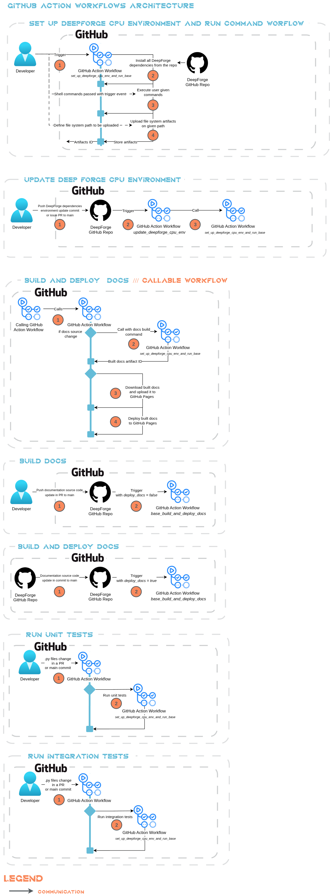

# Azure Infrastructure Documentation

This chapter describes deployed Azure cloud infrastructure used for Metron AI platform.

## GitHub Action Workflows

*Metron AI DeepForge* repo uses *GitHub Action Workflows* (CI/CD pipelines) to keep code quality and automatize tasks.

### Overview of Workflows Architecture

