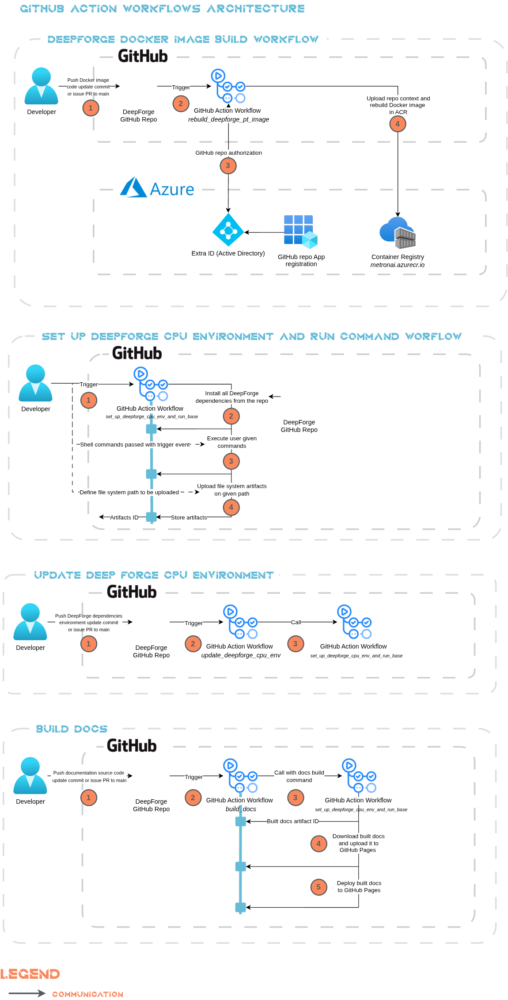
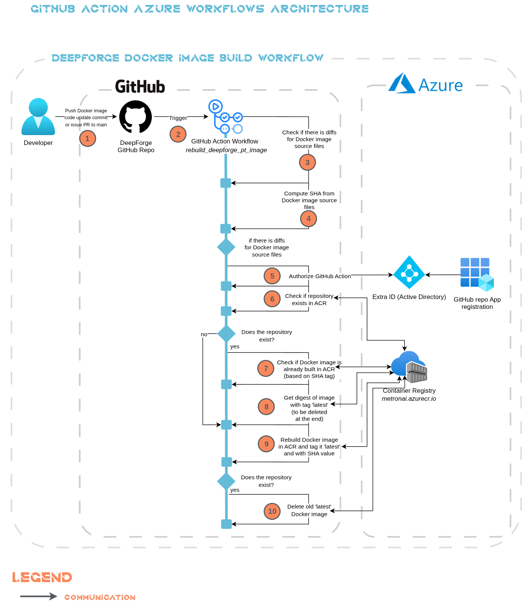

# CI/CD Infrastructure Documentation

This chapter describes CI/CD workflows architecture.

## GitHub Action Workflows

*Metron AI DeepForge* repo uses *GitHub Action Workflows* (CI/CD pipelines) to keep code quality and automatize tasks.

### Overview of CI/CD Workflows Architecture

### Overview of CI/CD Azure Workflows Architecture

