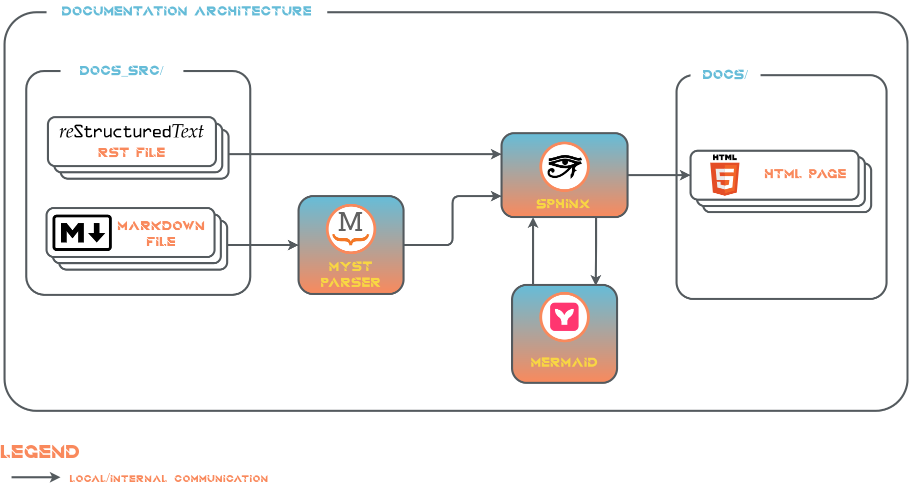

# Documentation Architecture

This section descibes the architecture of the documentation approach for Metron AI DeepForge.

The documentation is based on following frameworks:
- [*Sphinx*](https://www.sphinx-doc.org/en/master/index.html): Documentation generator tool.
- [*Markedly Structured Text (MyST)*](https://myst-parser.readthedocs.io/en/latest/#): A *Sphinx* extension to parse
  a rich and extensible flavour of *Markdown*.
- [*Mermaid*](https://mermaid.js.org/): *reST* extension framework for text based diagrams creation and plotting.



All documentation files are located in `/docs_src`. Docs files can be in `.rst` or `.md` format. Extended *Markdown*
formatting using *MyST Parser* is supported for `.md` files. The `/docs_src` folder structure is following:

```shell
/docs_src
    /_template # It stores custom templates for `sphinx-apidoc` tool.
    /api # The folder stores **autogenerated** API documentation using `sphinx-apidoc`.
    /arch # All architecture docs reside in here. 
    /diagram_projects # This folder contains all `draw.io` diagram projects.
    /imgs # The folder stores all exported `draw.io` diagram pictures and all others.
    /guides # The folder stores how-to guides or other guidelines.
    conf.py # Sphinx configuration file.
    index.rst # Main docs file.
    ... # Other documentation files.
```

*Sphinx* then loads all `.rst` and `.md` files and generates *HTML webpages* in `/docs`.

Documentation is **generated automatically** with every commit using *Git Hooks* given by *pre-commit* tool. Other option
is to generate docs **manually**, see the [documentation generation guide](../guides/docs_generation.md).

## Used Sphinx Extensions
The list of all used Sphinx extensions could be found in `docs_src/conf.py` in `<extensions>` list with a short description.

## Automatic API Docs Source Files Generation

Documentation's source `.rst` files of the Metron AI DeepForge code is generated and maintained automatically.
API docs source files are updated with every commit automatically, based on the latest source code state,
by corresponding *Git Hooks*. It uses  [`sphinx-apidocs`](https://www.sphinx-doc.org/en/master/usage/extensions/autodoc.html) CLI tool with custom templates.
The templates define the structured of generated `.rst` files. They are located
in `/docs_src/_template` and they are based on
[*Jinja templating engine*](https://jinja.palletsprojects.com/en/3.1.x/templates/).

## Emoticons in Docs

It is allowed to use emoticons in docs via *sphinxemoji* *Sphinx* extension. It can be used in `.md` and `.rst` files. Use the following syntax `|:emoticon_name:|` in `.rst` files.

It is required to wrap the syntax in a special admonition for `.md` files:
```markdown
:::{eval-rst}
|:emoticon_name:|
:::
```
