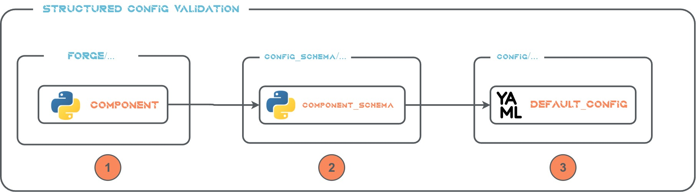

# Project Structure

```shell
├── config # Contains component's config files in Hydra framework and DeepForge's Pythons setting files.
├── config_schema # Contains component's Structured Config schema files (See https://hydra.cc/docs/tutorials/structured_config/schema/) used for config files type validation.
├── docs_src # Contains documentation source files.
├── forge # Contains custom reusable building blocks.
├── hydra_plugin # Stores Hydra plugins, for instance plugin for multiple config search paths.
├── tests # Tests implementation folder.
├── utils # DeepForge utilities.
```

## SW Components Configuration

Software component's parameters are configured using [Hydra](https://hydra.cc/) framework. Each SW component has corresponding *Structured Config Schema* for configuration validation on *Hydra* level.



1. SW component is implemented in `forge` package.


   For example, a new class called `SampleModel` is implemented in `forge/vision/sample.py`.

2. *Structured Config Schema* of implemented component is validated on Hydra level. One Python file could define *Structured Config Schema* for multiple classes and create a kind of "*Structured Config Schema* lib". Each **registered** *Structured Config Schema* class must have the `_target_` attribute, see [objects instantiation](https://hydra.cc/docs/advanced/instantiate_objects/overview/), pointing to a valid class. *Config Group* and *Package* notation shall follow logical internal grouping, see next section. **Each Python module (except modules starting with `_`) in `config_schema` must have `<register_lib()>` function, which registers *Structured Config Schemas* provided by the module.**


   In the example, a Python file `config_schema/vision/sample_config_schema.py` contains:

   ```python
   from dataclasses import dataclass

   from hydra.core.config_store import ConfigStore

   @dataclass
   class SampleModelConfig:
    """Configuration for Sample model."""

    _target_: str = "forge.vision.sample.SampleModel"

   def register_lib() -> None:
    """Register vision model configurations."""

    cs = ConfigStore.instance()
    cs.store(
        group="vision/models",
        name="samplemodel",
        node=SampleModelConfig,
        package="vision.models",
    )

   ```

3. Enduser facing component's `.yaml` config file located in `config` folder. Its nesting in folders shall represent enduser facing *Config Groups*. It must contain the mapping of stored node's name, under defined group, to given YAML file.

   In the example, a config file `config/vision/models/Sample.yaml` contains:

   ```yaml
   defaults:
    - /vision/models/samplemodel@_here_
    - _self_
   ```

### SW Components *Config Groups*

#### Internal *Config Groups*

```shell
├── vision
    ├── encoders_lib
        ├── resnet50
    ├── models_lib
        ├── diffusiondet
```

#### Enduser Facing *Config Groups*

```shell
├── vision
    ├── encoders
        ├── ResNet50
    ├── models
        ├── DiffusionDet
```

## New Use Case Skeleton

Use case represents a new programme/initiative/project/..., i.e. a high level project structure which could organized into smaller, more granular sub-projects. It is located in `usecases` folder.

Therefore, to create a new use case, we must create a new folder in `usecases` with with sub-project folders if needed.

In next sections, it is not distinguished between project or sub-project level.

Use case is configured using [Hydra](https://hydra.cc/) framework.

### Required Structure

```shell
├── train.py
├── config.yaml
```

#### *train.py*

Represents a training business logic of the project.

:::{attention}
Training script **must** use *Hydra* configuration framework and script's "main" function must be decorated with following decorators in the given order and the **same** values - `config_path="."` and `config_name="config"`.

```shell 
from metron_shared.config.config import set_hydra_config
from utils.runtime import register_all_config_schema_libs

@register_all_config_schema_libs
@hydra.main(version_base="1.3", config_path=".", config_name="config")
...
```

:::

#### *config.yaml*

Stores project's configuration. It shall be loaded by all project's Python's scripts. It compose configuration from component's configuration files stored in `config` folder.